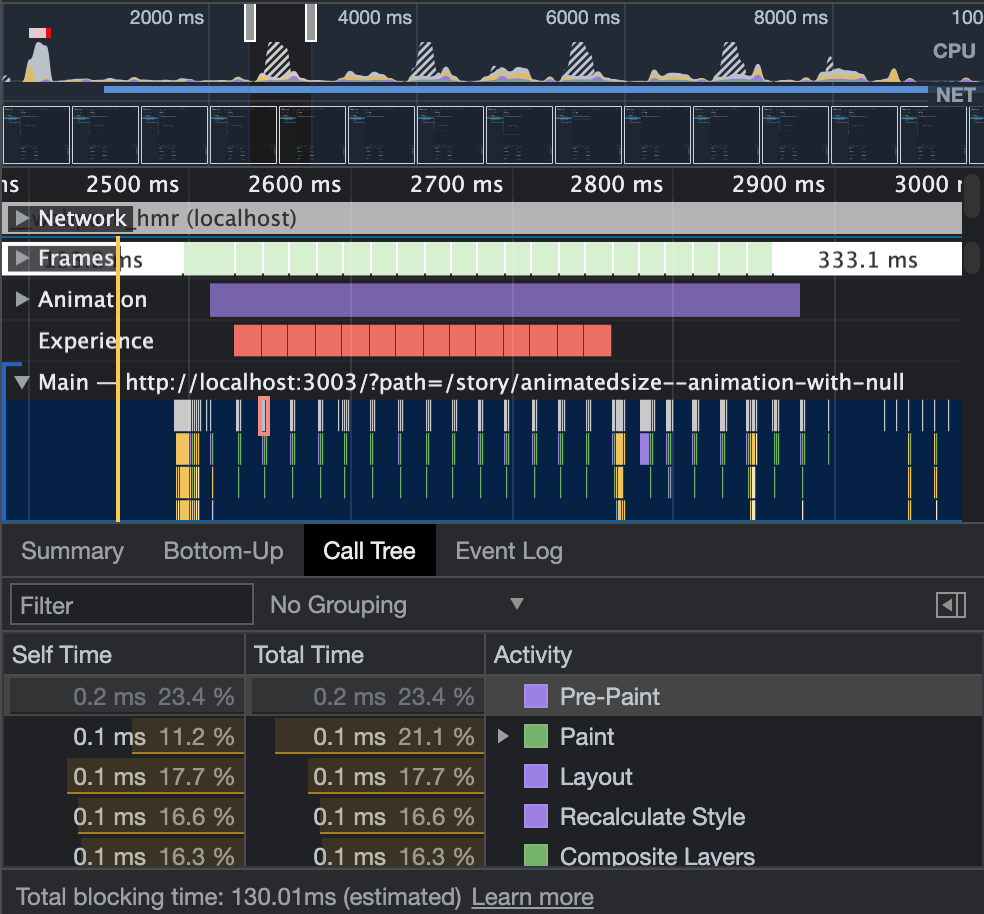

# AnimatedSize

## Introduce

This component provide flexible size-change animation for html element under `react` framework.

## Core content

AnimatedSize provide the features that let element's width/height animate between [auto](https://developer.mozilla.org/en-US/docs/Web/CSS/width) and size. Animation is provided by css `transition` so the component take less js-runtime compared with pure js implement.

<br/>


- nested `AnimatedSize` is also fine.

<br/>



- most of the job is html renderer paint, more animation with less js-runtime.

<br/>

## Install

```console
npm i animated-size
```

## Import

```jsx
import { AnimatedSize } from "animated-size";
```

## Size [Factor](./src//animated-length.tsx)

For example: element's `width` is `150px`.

```jsx
<AnimatedSize widthFactor={/* set your factor */}>
  {/* if the entirely auto width (wrapper by span) is 150px */}
  <Element0 />
  <Element1 />
</AnimatedSize>
```

This width property of inline style sheet:

| Type           | Property            | Code                   |
| -------------- | ------------------- | ---------------------- |
| number[2]      | 300px (150 \* 2 px) | `widthFactor={2}`      |
| string['50px'] | 50px                | `widthFactor={'50px'}` |
| auto           | auto                | `widthFactor={'auto'}` |
| null           | undefined           | `widthFactor={null}`   |

Factor change behaviors:

| From           | To             | Description                                                                                                           |
| -------------- | -------------- | --------------------------------------------------------------------------------------------------------------------- |
| number[2]      | auto           | animate from 300px to 150px, than set the width property as 'auto'                                                    |
| number[2]      | null           | animate from 300px to 150px, than set the width property as undefined (remove width property from inline style sheet) |
| string['50px'] | auto           | animate from 50px to 150px, than set the width property as 'auto'                                                     |
| string['50px'] | null           | animate from 50px to 150px, than set the width property as undefined (remove width property from inline style sheet)  |
|                |                |                                                                                                                       |
| auto           | number[2]      | set 150px, than animate from 150px to 300px                                                                           |
| null           | number[2]      | set 150px, than animate from 150px to 300px                                                                           |
| auto           | string['50px'] | set 150px, than animate from 150px to 50px                                                                            |
| null           | string['50px'] | set 150px, than animate from 150px to 50px                                                                            |
|                |                |                                                                                                                       |
| number[2]      | string['50px'] | animate from 300px to 50px                                                                                            |
| string['50px'] | number[2]      | animate from 50px to 300px                                                                                            |
|                |                |                                                                                                                       |
| auto           | null           | set the width property as undefined (remove width property from inline style sheet)                                   |
| null           | auto           | set the width property as auto                                                                                        |

- `widthFactor={undefined}` behaviors and `widthFactor={null}` behaviors are the same

## Custom wrapper

```jsx
<AnimatedSizeBuilder
  widthFactor={/* set your factor */}
  heightFactor={/* set your factor */}
  builder={(ref) => (
    <div ref={ref}>{/* set your element that wrapper by div */}</div>
  )}
/>
```

## Inner element position

By default, `AnimatedSize` use flex layout (and center inner element) and the inner element follow the flex.
<br/>
Change the parament `axisDirection`, `mainAxisPosition` and `crossAxisPosition` to custom your element position. Or directly set inline style sheet -- `style` parament.

```jsx
<AnimatedSize
  widthFactor={/* set your factor */}
  heightFactor={/* set your factor */}
  axisDirection="column"
  mainAxisPosition="start"
  crossAxisPosition="end">
  {/* your element */}
</AnimatedSize>

...

<AnimatedSize
  widthFactor={/* set your factor */}
  heightFactor={/* set your factor */}
  style={{
    display:'block',
    position:'relative',
    /* Don't override width or height or transition if you want animation to work properly */
    }}>
  {/* your element */}
</AnimatedSize>
```

## Demo

```console
git clone https://github.com/JohnGu9/AnimatedSize.git
cd AnimatedSize
npm i
npm run storybook
```

## Browser requirement

[ResizeObserver](https://developer.mozilla.org/en-US/docs/Web/API/ResizeObserver) support

| Type    | Version |
| ------- | ------- |
| Chrome  | 64      |
| Firefox | 69      |
| Safari  | 13.1    |

## Component dependencies

- React

## Issue report

https://github.com/JohnGu9/AnimatedSize

## LICENSE

[MIT](./LICENSE)
